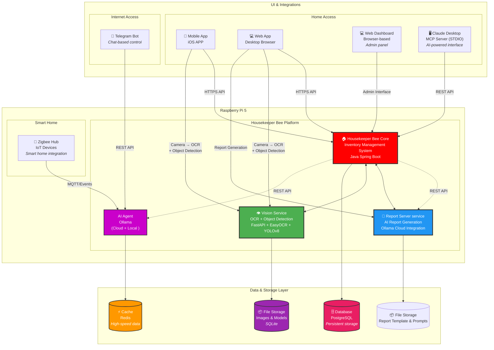

# HousekeeperBeeWebApp

## ✨What is Housekeeper Bee?

I built this for myself after spending too much time digging through 
boxes looking for things I knew I owned.

Housekeeper Bee is a free, self-hosted web app that runs on a 
Raspberry Pi 5. You label your storage boxes with barcodes, NFC 
tags, or iBeacons — then search or ask the AI what's in them and 
where they are. Everything stays on your own hardware.

**No subscription. No cloud. No catch.**


## ✨Project Background

https://vneticworkshop.wixsite.com/thomasleungportfolio/copy-of-projects

    

## ✨Description  

This page provides Household Items Management Web App binary and setup scripts.

I built this to solve a simple personal problem: I could never find anything in my own storage boxes. Housekeeper Bee is a self-hosted web app that tracks what's inside your storage boxes and where they are — using barcodes, NFC tags, and iBeacon. It runs on a Raspberry Pi 5 and keeps all your data local.    

Key Features of this app extends the functionality of web-based application :

1. Photo Capture: Take and share photos directly within the app for quick documentation.

2. Face ID Login: Enjoy secure access through Face ID, ensuring your data is protected.

3. NFC Tag Reading: Quickly read NFC tags to streamline inventory management and product identification.

4. EAN-13 Barcode Scanning: Effortlessly scan EAN-13 barcodes, enhancing accuracy in tracking household Items and fetch product profile from barcode database.

5. iBeacon Location Services: Easily locate iBeacons to finding the missing storage boxes.

## ✨Get the Code 

### Option A: Download a ZIP file

https://github.com/Thomas-Leung-852/HousekeeperBeeWebApp/archive/refs/heads/main.zip

### or   

### Option B: Git Clone

```
git clone https://github.com/Thomas-Leung-852/HousekeeperBeeWebApp.git
```

## ✨Setup Procedure

### Part A - Install Raspberry Pi OS (Ubuntu <u>Desktop</u> 24.04 LTS)  
Dome: <a href="https://youtu.be/p9k2Mc3MpTE?si=8Wu3y2Xy_TV1Z2vv" target="_blank">https://youtu.be/p9k2Mc3MpTE?si=8Wu3y2Xy_TV1Z2vv</a>


Source: https://pimylifeup.com/raspberry-pi-ubuntu/

### Part B - Setup Ubuntu Desktop  
Demo: <a href="https://youtu.be/0s-VTIfdZuI?si=qQCB3shDIud8lznI" target="_blank">https://youtu.be/0s-VTIfdZuI?si=qQCB3shDIud8lznI</a>

      
    

### Part C - How to use shell scripts to setup the Housekeeper Bee Backend (Household Items Management Server)    

[ Method 1 ] One command setup - 
<a href="https://youtu.be/D7ZOcX-viFg?si=SHwjjFFe7CXiHBII" target="_blank">https://youtu.be/D7ZOcX-viFg?si=SHwjjFFe7CXiHBII</a>     
[ Method 2 ] For advanced users - https://youtu.be/Q1--e4d7-3I?si=mauKBkNFu-rs_9SU

## ✨ Test Connection

https://{your-ip-address}:8443

    
    

<br/>

http://{your-ip-address}:8088     

     

## ✨ Install iOS APP

### Part D - Integrate backend with iPhone APP (Housekeeper Bee Mobile)       
<a href="https://youtu.be/Hd59EvuuvnE?si=aSDc4aFpYkUrz_U9" target="_blank">https://youtu.be/Hd59EvuuvnE?si=aSDc4aFpYkUrz_U9</a> 

    
Download APP from Apple App Store: https://apps.apple.com/us/app/housekeeper-bee/id6742815735       

#### The Mobile Touch Point - Housekeeper Bee iPhone App     
Gone are the days of scrawling labels on boxes that fade, peel, or become unreadable. Housekeeper Bee transforms your iPhone into a professional-grade storage management tool, replacing dedicated barcode scanners, NFC readers, and Bluetooth detectors with the one device already in your pocket.
Attach a barcode label to any box, scan it once, and build a complete digital record of everything inside, complete with photos, descriptions, and location data. The next time you need something, search the app and it tells you exactly which box it is in and where that box lives.
Housekeeper Bee goes further by solving the hidden storage problem. Overhead totes, high shelves, and stacked containers are no longer black holes. Using iBeacon technology, the app detects Bluetooth signals tied to both the storage location and the box, giving you instant visibility into what is there before you climb a ladder or move a single item. Walk into a room and your storage announces itself to you.    

The app also supports household collaboration. Family members can access shared storage data, find items independently, and contribute to a living inventory that grows with your home.


<table>
<tr style="page-break-inside: avoid;" >
   <td>
</td>
   <td></td>
   <td></td>
   <td></td>
</tr>
<tr style="page-break-inside: avoid;" >
   <td></td>
   <td></td>
   <td></td>
   <td></td>
</tr>
<tr style="page-break-inside: avoid;" >
   <td></td>
   <td></td>
   <td></td>
   <td></td>
</tr>
</table>

## ✨ Barcode template (Brother TZe-251/ TZe-615/ DR1201/ DR2205/ DR2251) and NFC Tag (ISO 144443)

You can free to use the Brother printer label template and Excel template.    
Those files can be found from  https://github.com/Thomas-Leung-852/HousekeeperBeeWebApp/wiki/Print-your-own-labels 

       


## ✨ Supported iBeacon

- HolyIot (Model: 16032 and 21014)
- April Brother (Model: EEK-N20)


## ✨ iOS App: Link Storage to Barcode / NFC / iBeacon

<a href="https://www.youtube.com/watch?v=nN9iC1CJG3g" target="_blank">Housekeeper Bee Mobile App Demo</a>    

[](https://youtu.be/nN9iC1CJG3g)    


## ✨When should use iBeacon

<table>
<tr><td>    
    
</td><td>
    
</td>
</tr>
</table>

## ✨Finder (Client/Server)

This is an optional add-on program for Housekeeper Bee. If you don't want to memorize the IP address and port number, and don't want to install Pi-hole, you can use the Finder tool.

Install the Finder Server on your Housekeeper Bee's Raspberry Pi 5 device, and install the Finder Client on your Windows, MacOS, or Linux machine (home PC, desktop, or notebook).

How it works: The client sends a UDP message to the server, and the server replies with its IP address and port. Click on the provided link to launch the Housekeeper Bee application.

Of course, you can bookmark the IP and port. But the Finder is especially helpful when first using a pre-configured device from us. Just plug in a LAN cable to your router and Housekeeper Bee device, download the clent to your Notebook and build the client distribution, then launch the client to discover the Housekeeper Bee device automatically.

### [ 1 ] Setup Server on Housekeeper Bee device (Raspberry Pi 5)

- Go to the `housekeeping_bee/finder` folder
- Change the shell script file to executable: `chmod +x ./setup_server.sh`
- Run `./setup_server.sh`
- Reboot the Housekeeper Bee device

**⚠️ A self-signed certificate is created at first run.

### [ 2 ] Setup Client 
### 🫧 Setup Client on your PC (Normal Run)

Copy the `housekeeping_bee/finder/client` folder to your PC/MacBook

- Go to the `client` folder
- Run `npm install`
- Run `npm start` to launch the client application

### 🫧 Setup Client on your PC (Build Binary File)

Copy the `housekeeping_bee/finder/client` folder to your PC/MacBook

- Launch a terminal with administrator privileges
- Go to the `housekeeping_bee/finder/client` folder
- Type `npm run build` to build the application
- Go to the `dist` folder
- Select the binary file to launch the client application (filename depends on your OS)

#### ✦ Client found a active Housekeeper Bee device on local network ####
     
      
#### ✦ Click on the device profile and start configurate the WiFi (LAN connection required), open the Web App and Admin App. 


---

**⚠️ Important: Disable VPN Before Using**

Please close your VPN application before running the Finder client. If VPN is active, your IP may use 10.x.x.x addresses, which prevents the client from finding HK Bee on your local network.


<br/>

## ✨Application Updater (Recommended to install for keeping your application updated. Housekeeper Bee v1.12.0 or higher - Default installed and enabled)

While you can download the JAR file to a USB drive containing an empty file named `update_housekeeper_bee.txt` or `update_housekeeper_bee_license.txt` for a manual update via http://ip:8088, the recommended and most effective solution is to use the `Application Updater`.

Once installed, the `Application Updater` allows you to enable auto-updates or manually update through the web UI and a Linux cron job. It checks for updates twice a day and automatically schedules updates for the application and settings, ensuring you always have the latest enhancements and features.

Download from GitHub:  https://github.com/Thomas-Leung-852/HousekeeperBeeWebAppUpdateTool

       
       

## ✨ System Administration 

http://{ip}:8088   

You can disable unused modules to save memory and enhance system performance. Additionally, you can deploy AI system modules on more powerful machines. The service-oriented architecture enables all components to run seamlessly and function effectively on the same local network.     

- Monitoring system health & Schedule shutdown and bootup time    
- Flexible Module Management: Empower users to manage modules according to their specific requirements.   
- Modular Deployment: Facilitate the deployment of modules across different machines seamlessly.    

<br>

 
 

<br>

## ✨Housekeeper Bee Vision service

You can get it from https://github.com/Thomas-Leung-852/housekeeper-bee-vision      

**Housekeeper Bee Vision Service** is a production-ready AI microservice that provides **Optical Character Recognition (OCR)** and **Object Detection** capabilities. Built with Python FastAPI and optimized for mobile devices, it serves as the "eyes" for the Housekeeper Bee Household and Inventory Management ecosystem. You can access the vision administration page via https://{your ip}:8000/login .The default user name is 'admin' and password is 'pwd'.       

⚠️ Please change the default password immediately after your first login.     

### - Create an API key to access the vision service 


### - Add the vision url and API key to `application.properties` file of Housekeeper Bee java spring boot application and then reboot.


```
#==================================================
# Apply to vesion 1.11.0
# Connect to vision service
#==================================================
vision.api.url={Vision service IP}     # Exmaple https://192.168.50.102:8000
vision.api.key={Vision API key}
```       

### - After connecting to the vision service, you will find the `OCR Scanner` and `Object Detection` buttons in both the add and edit UI for storage.     


<br>

## ✨Housekeeper Bee Ecosystem Architecture Diagram

Housekeeper Bee Ecosystem Architecture     
Breaking Free from the Monolith    

**Housekeeper Bee** reimagines home management software through a **decentralized, 
modular architecture** that puts you in control. Unlike traditional all-in-one 
applications where features are hardwired and unchangeable, Housekeeper Bee is 
built as a **loosely-coupled ecosystem** of specialized services—each independently 
deployable, upgradeable, and optional—**optimized to run efficiently on Raspberry 
Pi 5 with just 4GB RAM**.

**At the heart** is a lightweight core application that orchestrates inventory 
management and user workflows. **Orbiting around it** are powerful AI capabilities—
OCR for text recognition, object detection for visual cataloging, LLM-powered 
report generation—alongside physical integrations like iBeacon location tracking 
and Zigbee environmental sensors—each living as an autonomous microservice that 
can be installed on-demand, enabled with a click, or disabled when not needed.

**This architectural approach delivers unprecedented flexibility:**

✨ **Install What You Need** → Start with basic inventory, add AI modules as your needs grow  
🔄 **Enable/Disable On-the-Fly** → Toggle services instantly through the admin panel  
🚀 **Future-Proof Design** → New AI models? Just plug them in—no app rebuild required  
🧩 **Mix and Match** → Combine services in creative ways we haven't imagined  
📦 **No Bloat** → Run only what you use, conserve system resources  
🏠 **Self-Hosted** → Runs on Raspberry Pi 5 (4GB) with room to spare

The diagram below illustrates how these independent services communicate through well-defined APIs while maintaining complete operational autonomy. Like instruments in an orchestra, each plays its part perfectly while contributing to a harmonious whole.     

<br>




## ✨Wiki
  

