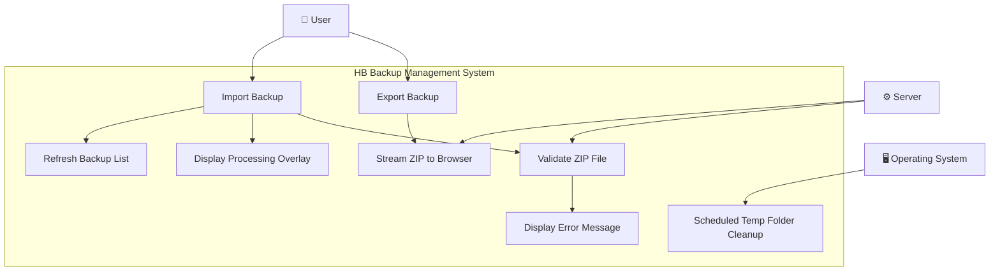
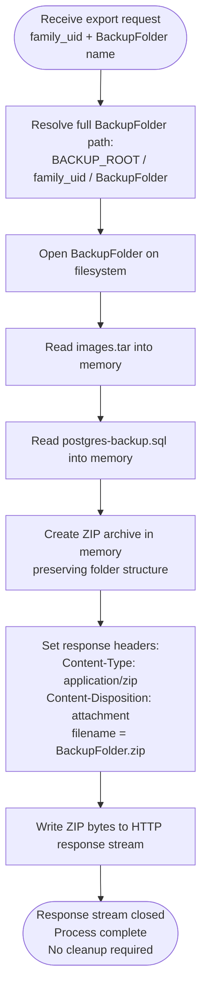
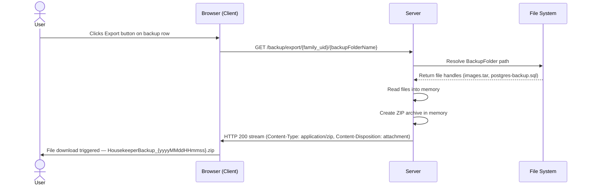
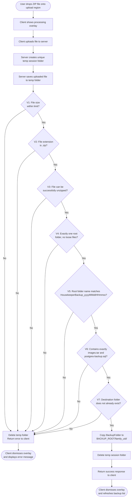
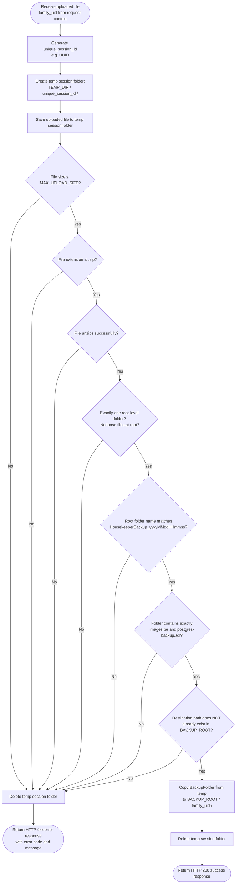
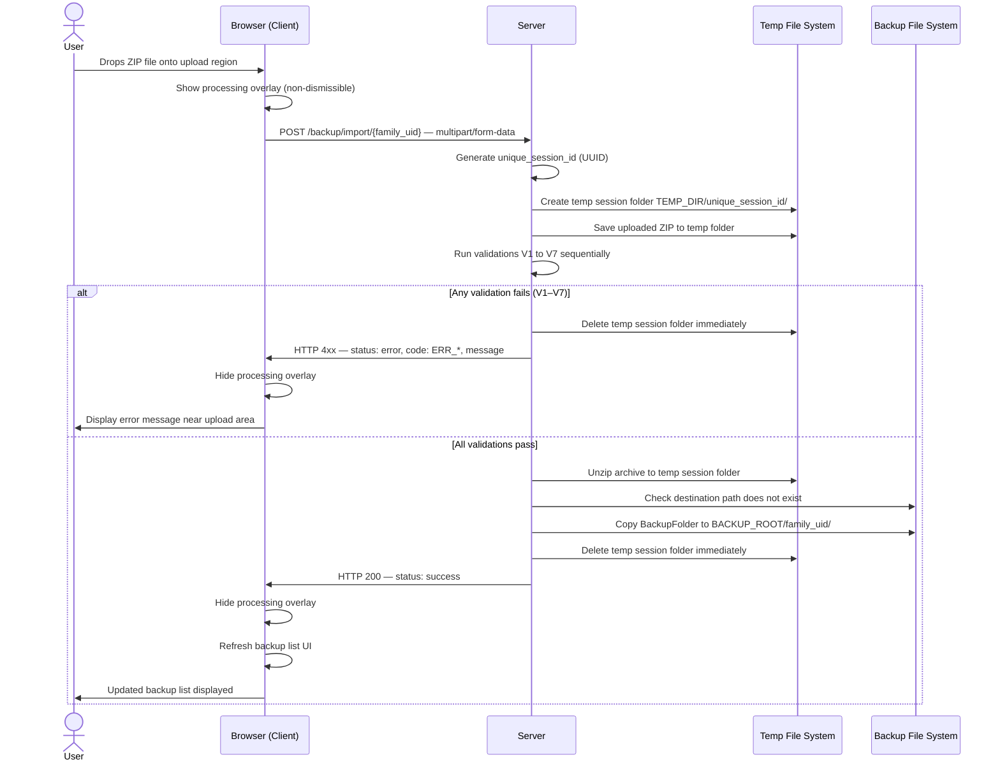

# HB Export and Import Backup Function — Design Specification
**Version:** 1.3  
**Status:** Final Draft  
**Last Updated:** 2025-03-05   
**Prompt By:** Thomas   
**Created By:** Claude Desktop 4.6

---

## Table of Contents

1. [Overview](#1-overview)
2. [Glossary](#2-glossary)
3. [System Configuration Parameters](#3-system-configuration-parameters)
4. [Backup Folder Structure](#4-backup-folder-structure)
5. [Use Case Diagram](#5-use-case-diagram)
6. [Export Function Specification](#6-export-function-specification)
   - 6.1 [UI Requirements](#61-ui-requirements)
   - 6.2 [Business Rules](#62-business-rules)
   - 6.3 [Process Flow](#63-process-flow)
   - 6.4 [Export Server-Side Process Flowchart](#64-export-server-side-process-flowchart)
   - 6.5 [Export Sequence Diagram](#65-export-sequence-diagram)
7. [Import Function Specification](#7-import-function-specification)
   - 7.1 [UI Requirements](#71-ui-requirements)
   - 7.2 [Business Rules](#72-business-rules)
   - 7.3 [Validation Rules](#73-validation-rules)
   - 7.4 [Process Flow](#74-process-flow)
   - 7.5 [Import Validation Flowchart](#75-import-validation-flowchart)
   - 7.6 [Import Server-Side Process Flowchart](#76-import-server-side-process-flowchart)
   - 7.7 [Import Sequence Diagram](#77-import-sequence-diagram)
8. [UI Overlay Behaviour](#8-ui-overlay-behaviour)
9. [Error Messages](#9-error-messages)
10. [Temp Folder Management](#10-temp-folder-management)
11. [Appendix A — Java Spring Boot Implementation Notes](#appendix-a--java-spring-boot-implementation-notes)

---

## 1. Overview

This specification describes the **Export** and **Import** functions for the HousekeeperBee (HB) backup management feature. These functions allow a user to:

- **Export** a specific backup snapshot as a downloadable `.zip` file directly from the backup list UI.
- **Import** a previously exported `.zip` file to restore a backup snapshot into the system.

The specification is written in **language-agnostic, behavioural terms** so that it can be implemented in any server-side web framework. A technology-specific appendix for Java Spring Boot is provided separately in [Appendix A](#appendix-a--java-spring-boot-implementation-notes).

---

## 2. Glossary

| Term | Definition |
|---|---|
| `HOUSEKEEPER_BEE_HOME` | The root installation directory of the application on the server. |
| `BACKUP_ROOT` | The base path where all backup folders are stored. Defined as `{HOUSEKEEPER_BEE_HOME}/housekeeping_bee/backup/`. |
| `TEMP_DIR` | A configurable directory used to store temporary files during the import process. See [Section 3](#3-system-configuration-parameters). |
| `family_uid` | A unique identifier for the family/tenant. Used to namespace backup folders per family. |
| `BackupFolder` | A single backup snapshot directory named using the convention `HousekeeperBackup_{yyyyMMddHHmmss}`. |
| `BackupArchive` | A `.zip` file containing one `BackupFolder`, produced by the Export function. |
| `yyyyMMddHHmmss` | A timestamp format: 4-digit year, 2-digit month, 2-digit day, 2-digit hour (24h), 2-digit minute, 2-digit second. Example: `20250305143022`. |

---

## 3. System Configuration Parameters

The following parameters must be defined in the application's configuration file or environment variables. They must not be hardcoded in application logic.

| Parameter | Description | Example Value |
|---|---|---|
| `HOUSEKEEPER_BEE_HOME` | Root installation directory of the application. | `~/Desktop` |
| `BACKUP_ROOT` | Root path for all backup data. | `{HOUSEKEEPER_BEE_HOME}/housekeeping_bee/backup/` |
| `TEMP_DIR` | Root path for temporary upload/processing files. | `{HOUSEKEEPER_BEE_HOME}/housekeeping_bee/temp/` |
| `MAX_UPLOAD_SIZE` | Maximum allowed file size for import uploads. | `300MB` |
| `TEMP_RETENTION_DAYS` | Number of days before orphaned temp folders are eligible for cleanup. | `30` |

---

## 4. Backup Folder Structure

Each backup snapshot resides on the server filesystem at the following path:

```
{BACKUP_ROOT}/{family_uid}/HousekeeperBackup_{yyyyMMddHHmmss}/
```

Each `BackupFolder` contains exactly two files:

```
HousekeeperBackup_{yyyyMMddHHmmss}/
├── images.tar
└── postgres-backup.sql
```

No other files or subdirectories are expected inside a valid `BackupFolder`.

---

## 5. Use Case Diagram

This diagram describes the actors involved and the use cases they can perform within the Export and Import feature.



> **Actors:**
> - **User** — the authenticated family member interacting with the backup management UI.
> - **Server** — the application backend responsible for all file processing, validation, and streaming.
> - **Operating System** — runs the scheduled cleanup job for orphaned temp folders independently of the application.

> **Use Case Relationships:**
> - `Import Backup` **includes** `Validate ZIP File`, `Display Processing Overlay`, and `Refresh Backup List` (on success).
> - `Validate ZIP File` **extends** with `Display Error Message` on any validation failure.
> - `Export Backup` **includes** `Stream ZIP to Browser`.

---

## 6. Export Function Specification

### 6.1 UI Requirements

- The backup list page displays a table or list of available backup snapshots for the current `family_uid`.
- Each row in the list includes an **Export** button.
- The Export button is labelled clearly (e.g. "Export" or a download icon with a label).
- No confirmation dialog is required before exporting.
- The export is triggered entirely by the single button click.

### 6.2 Business Rules

1. The export function packages a single `BackupFolder` into a `.zip` archive in server memory.
2. The `.zip` archive is **never written to the server filesystem**. It is streamed directly to the client browser.
3. The name of the downloaded file must follow this convention:
   ```
   HousekeeperBackup_{yyyyMMddHHmmss}.zip
   ```
   where the timestamp matches the timestamp in the source `BackupFolder` name.
4. The server must set the HTTP response headers to instruct the browser to download the file as an attachment, not to render it in the browser.
5. The `.zip` archive must preserve the `BackupFolder` directory structure internally, so that when unzipped, the result is:
   ```
   HousekeeperBackup_{yyyyMMddHHmmss}/
   ├── images.tar
   └── postgres-backup.sql
   ```

### 6.3 Process Flow

1. User clicks the **Export** button on a backup row.
2. The client sends a request to the server, identifying the `family_uid` and the target `BackupFolder` name.
3. The server resolves the full path to the `BackupFolder`:
   ```
   {BACKUP_ROOT}/{family_uid}/{BackupFolder}/
   ```
4. The server reads all files within the `BackupFolder` into memory.
5. The server creates a `.zip` archive in memory containing the folder and its two files.
6. The server writes the `.zip` archive to the HTTP response stream with the appropriate headers.
7. The browser receives the stream and triggers the file download automatically.
8. The process is complete. No server-side cleanup is required.

### 6.4 Export Server-Side Process Flowchart

This flowchart covers the server-side processing steps only, from receiving the request to streaming the response.



### 6.5 Export Sequence Diagram



---

## 7. Import Function Specification

### 7.1 UI Requirements

- The backup management page includes a dedicated **Import** section.
- The import section contains a **drag-and-drop upload region** where users can drop a `.zip` file to begin the import process.
- The upload region also supports a standard file picker (click to browse) as a fallback.
- Only one file may be uploaded per import operation.
- When the upload begins, a **full-page blocking overlay** is displayed. See [Section 8](#8-ui-overlay-behaviour) for overlay behaviour rules.
- The overlay remains visible until the server responds with either a success result or an error.
- On success, the backup list is refreshed to reflect the newly imported backup.
- On error, the overlay is dismissed and an error message is displayed to the user inline on the page.

### 7.2 Business Rules

1. The uploaded file is saved to a **unique session subfolder** within `TEMP_DIR` to prevent collisions between concurrent uploads:
   ```
   {TEMP_DIR}/{unique_session_id}/
   ```
   where `unique_session_id` is a UUID or equivalent unique identifier generated at the time of upload.
2. The server attempts to unzip the uploaded file into the session subfolder.
3. All validation checks (see [Section 7.3](#73-validation-rules)) are performed sequentially. On the first failure, the process terminates, the temp session folder is deleted immediately, and the error is returned to the client.
4. If all validations pass, the server checks whether the `BackupFolder` already exists in the target destination:
   ```
   {BACKUP_ROOT}/{family_uid}/{BackupFolder}/
   ```
5. If the destination folder **already exists**, the import is **rejected with an error message**. The process terminates and the temp session folder is deleted immediately.
6. If the destination folder **does not exist**, the server copies the `BackupFolder` from the temp session folder to the destination.
7. After a successful copy, the temp session folder is deleted immediately.
8. The server returns a success response to the client.
9. The client dismisses the overlay and refreshes the backup list.

### 7.3 Validation Rules

Validations are executed in the following strict order. Each check must pass before the next is evaluated.

| # | Check | Failure Behaviour |
|---|---|---|
| V1 | The uploaded file size must not exceed `MAX_UPLOAD_SIZE`. | Reject with error `ERR_FILE_TOO_LARGE`. |
| V2 | The uploaded file extension must be `.zip`. | Reject with error `ERR_INVALID_EXTENSION`. |
| V3 | The uploaded file must be a valid zip archive (i.e. it can be successfully unzipped). | Reject with error `ERR_CANNOT_UNZIP`. |
| V4 | The unzipped archive must contain exactly one root-level folder and no loose files at the root. | Reject with error `ERR_INVALID_STRUCTURE`. |
| V5 | The root folder name must match the naming convention `HousekeeperBackup_{yyyyMMddHHmmss}` exactly. | Reject with error `ERR_INVALID_FOLDER_NAME`. |
| V6 | The root folder must contain exactly two files: `images.tar` and `postgres-backup.sql`. No other files or subdirectories are permitted. | Reject with error `ERR_INVALID_CONTENTS`. |
| V7 | The resolved destination path must not already exist in `{BACKUP_ROOT}/{family_uid}/`. | Reject with error `ERR_FOLDER_ALREADY_EXISTS`. |

### 7.4 Process Flow

1. User drops a `.zip` file onto the upload region (or selects via file picker).
2. The client displays the **processing overlay** immediately.
3. The client uploads the file to the server.
4. The server generates a `unique_session_id` and creates a temp session folder:
   ```
   {TEMP_DIR}/{unique_session_id}/
   ```
5. The server saves the uploaded file into the temp session folder.
6. The server executes validation checks V1 through V7 in order.
   - On any failure: delete temp session folder → return error response → client dismisses overlay and shows error message.
7. All validations pass. The server copies the `BackupFolder` to:
   ```
   {BACKUP_ROOT}/{family_uid}/{BackupFolder}/
   ```
8. The server deletes the temp session folder immediately.
9. The server returns a success response to the client.
10. The client dismisses the overlay and refreshes the backup list UI.

### 7.5 Import Validation Flowchart



### 7.6 Import Server-Side Process Flowchart

This flowchart covers the server-side processing steps only, from receiving the uploaded file to returning the final response.



### 7.7 Import Sequence Diagram



---

## 8. UI Overlay Behaviour

The processing overlay is a UI element that blocks user interaction during the import operation.

| Rule | Description |
|---|---|
| **Trigger** | Overlay is shown immediately when the file upload begins (on drop or file selection). |
| **Content** | Overlay displays a visible processing indicator (e.g. spinner or progress message) and a human-readable status message such as "Uploading and validating backup file…". |
| **Blocking** | The overlay must prevent all user interaction with the page beneath it. It must not be dismissible by clicking outside it or pressing Escape. |
| **Dismiss on success** | Overlay is hidden when the server returns a success response. |
| **Dismiss on error** | Overlay is hidden when the server returns any error response. |
| **Error display** | After the overlay is dismissed due to an error, the error message is displayed inline on the page in a visible, clearly styled error region near the upload area. |

---

## 9. Error Messages

The following error codes and their corresponding human-readable messages must be implemented. Messages may be localised.

| Error Code | Display Message |
|---|---|
| `ERR_FILE_TOO_LARGE` | "The file exceeds the maximum allowed upload size. Please check the file and try again." |
| `ERR_INVALID_EXTENSION` | "Invalid file type. Only .zip files are accepted." |
| `ERR_CANNOT_UNZIP` | "The uploaded file could not be opened as a zip archive. The file may be corrupted." |
| `ERR_INVALID_STRUCTURE` | "The zip archive does not contain a valid backup structure." |
| `ERR_INVALID_FOLDER_NAME` | "The backup folder name does not match the expected naming convention (HousekeeperBackup_yyyyMMddHHmmss)." |
| `ERR_INVALID_CONTENTS` | "The backup archive must contain exactly two files: images.tar and postgres-backup.sql." |
| `ERR_FOLDER_ALREADY_EXISTS` | "A backup with this timestamp already exists. Import has been cancelled." |

---

## 10. Temp Folder Management

### 10.1 Immediate Cleanup (Application Responsibility)
The application is responsible for deleting the temp session folder in all of the following cases:
- Any validation check fails (V1–V7).
- The import copy operation completes successfully.

### 10.2 Scheduled Cleanup (Operations Responsibility)
A scheduled shell script (managed by the OS scheduler, e.g. cron) must periodically clean up any orphaned temp session folders that were not removed by the application (e.g. due to a server crash or unexpected error).

| Parameter | Value |
|---|---|
| Target directory | `{TEMP_DIR}/` |
| Cleanup threshold | Folders older than `TEMP_RETENTION_DAYS` days |
| Recommended schedule | Once daily |

The shell script logic should be equivalent to:
```
find {TEMP_DIR}/ -mindepth 1 -maxdepth 1 -type d -mtime +{TEMP_RETENTION_DAYS} -exec rm -rf {} \;
```

---

## Appendix A — Java Spring Boot Implementation Notes

> This appendix is informational only. It describes recommended implementation patterns for Java Spring Boot with Thymeleaf. The core business logic defined in this specification must not change regardless of the technology stack used.

### A.1 Environment & Framework
- **Language:** Java (17+)
- **Framework:** Spring Boot (MVC pattern)
- **Template Engine:** Thymeleaf
- **Deployment OS:** Ubuntu Linux

### A.2 Configuration Parameters
Define all parameters from [Section 3](#3-system-configuration-parameters) in `application.properties` or `application.yml`:

```properties
app.backup.root=${HOUSEKEEPER_BEE_HOME}/housekeeping_bee/backup/
app.backup.temp-dir=${HOUSEKEEPER_BEE_HOME}/housekeeping_bee/temp/
app.backup.max-upload-size=300MB
app.backup.temp-retention-days=30
```

Also set Spring's multipart upload limit:
```properties
spring.servlet.multipart.max-file-size=300MB
spring.servlet.multipart.max-request-size=300MB
```

### A.3 Export Endpoint

- **HTTP Method:** `GET`
- **Recommended URL pattern:** `/backup/export/{family_uid}/{backupFolderName}`
- **Controller returns:** `ResponseEntity<StreamingResponseBody>` or writes directly to `HttpServletResponse`
- **Key headers to set:**
  ```
  Content-Type: application/zip
  Content-Disposition: attachment; filename="HousekeeperBackup_{yyyyMMddHHmmss}.zip"
  ```
- **In-memory zipping:** Use `ZipOutputStream` wrapped around a `ByteArrayOutputStream`, or stream directly via `ZipOutputStream` on `response.getOutputStream()` to avoid buffering large files in heap memory.

### A.4 Import Endpoint

- **HTTP Method:** `POST`
- **Recommended URL pattern:** `/backup/import/{family_uid}`
- **Request:** `multipart/form-data` with a single file field
- **Controller accepts:** `@RequestParam("file") MultipartFile file`
- **Unique session folder:** Use `UUID.randomUUID().toString()` to generate the `unique_session_id`
- **Unzipping:** Use `java.util.zip.ZipInputStream` to extract the uploaded file to the temp session folder
- **File copy:** Use `java.nio.file.Files.copy()` or `Files.move()` to transfer the validated `BackupFolder` to `BACKUP_ROOT`
- **Response format:** Return JSON with a `status` field (`"success"` or `"error"`) and a `message` field for the UI to consume

### A.5 Frontend (Thymeleaf + JavaScript)

- The drag-and-drop region should use the HTML5 `dragover` and `drop` events
- On file drop or file input `change`, immediately show the overlay div, then submit the file via `XMLHttpRequest` or `fetch()` as `FormData`
- Parse the JSON response on completion and either refresh the page (success) or display the error message and hide the overlay (error)
- The overlay `div` should have CSS `position: fixed`, `z-index` high enough to cover all content, and `pointer-events: all` to block interaction

### A.6 Scheduled Cleanup
- The cleanup shell script can be scheduled via `crontab` on Ubuntu
- Example cron entry (runs daily at 2:00 AM):
  ```
  0 2 * * * find $HOUSEKEEPER_BEE_HOME/housekeeping_bee/temp/ -mindepth 1 -maxdepth 1 -type d -mtime +30 -exec rm -rf {} \;
  ```
- This is managed outside the Spring Boot application and does not require a Spring `@Scheduled` task
